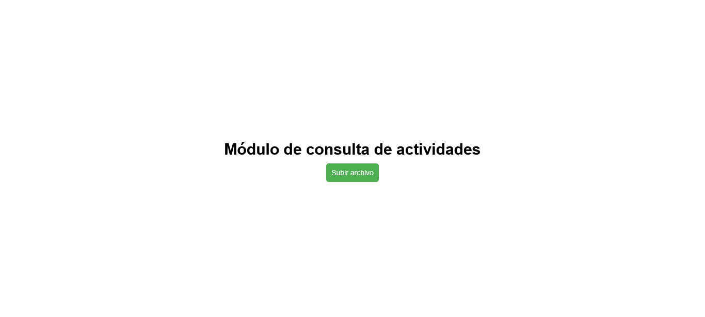
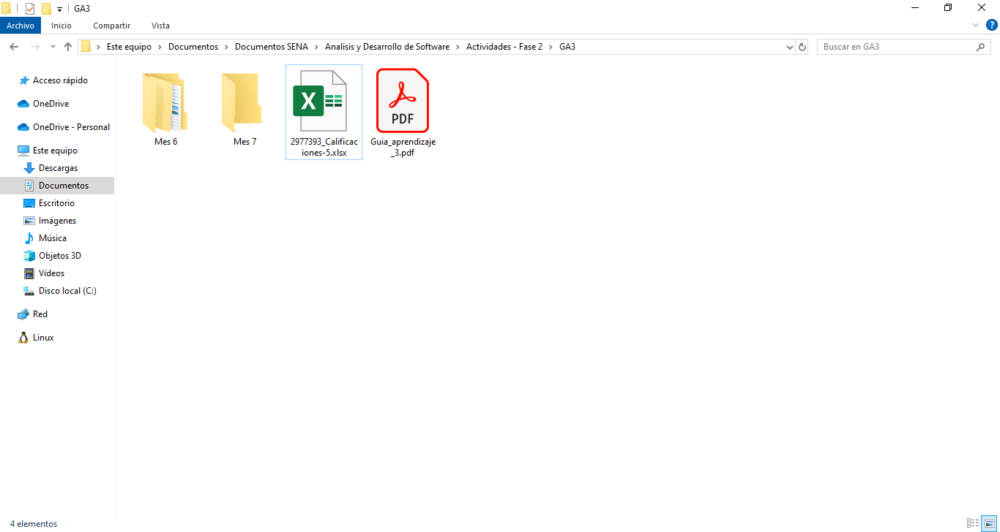
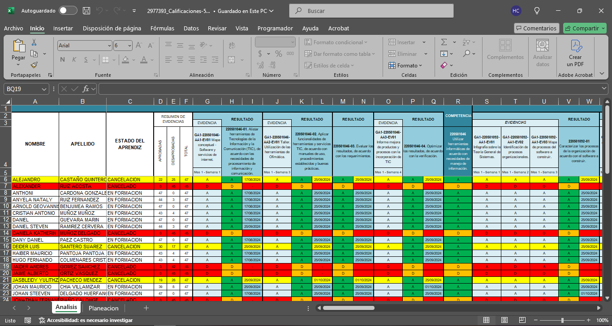
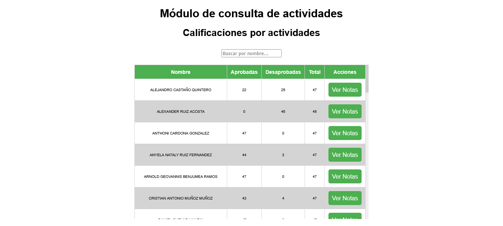
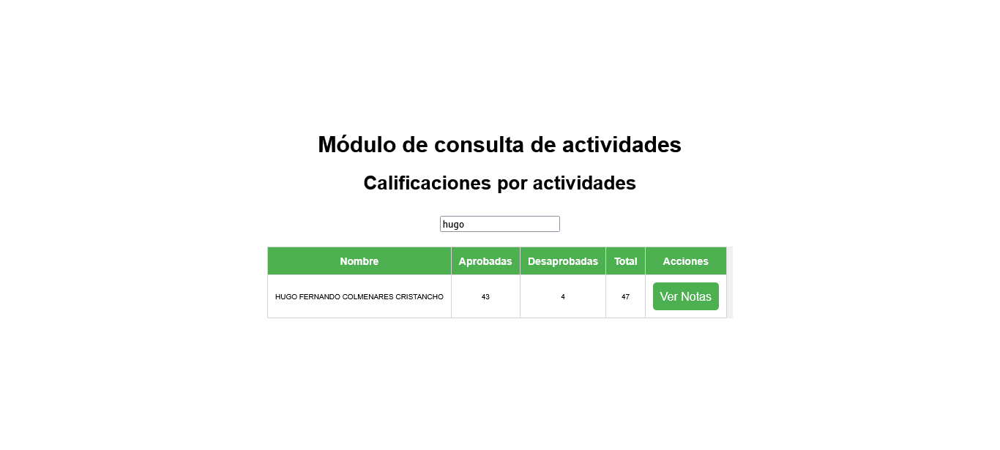
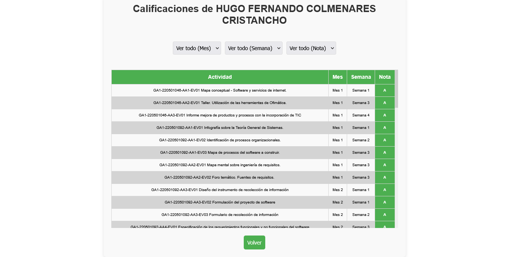
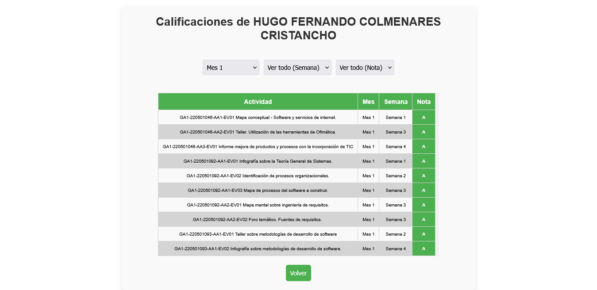
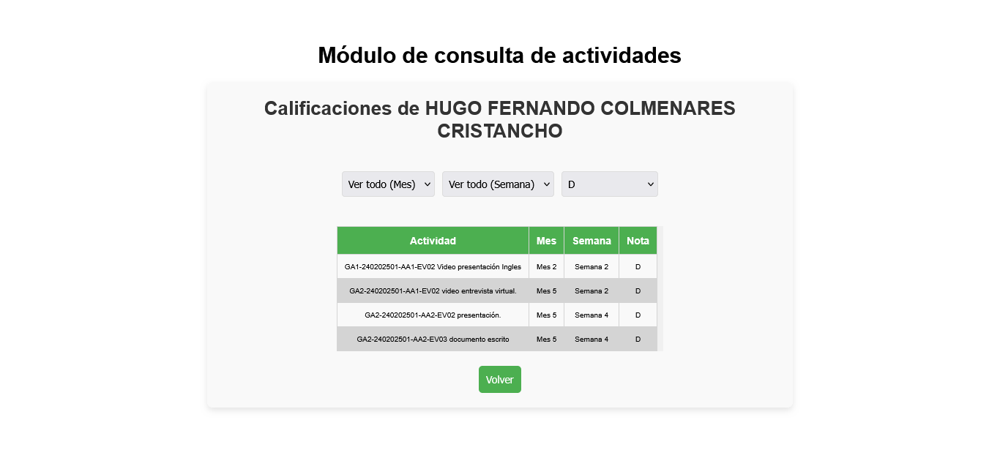

# 📚 **NotasApp** - Visualizador de Notas

¡Bienvenido a **NotasApp**! 🎉  
Una aplicación desarrollada en Angular por **FeithNoir** como parte del curso de **Análisis y Desarrollo de Software**. Esta herramienta está diseñada para facilitar la visualización y gestión de las notas enviadas por el instructor. ¡Organiza tus notas como un pro! 🚀

---

## 🚀 **Introducción**

**NotasApp** es una aplicación web desarrollada en **Angular** que permite a los instructores y estudiantes visualizar y filtrar las notas de manera rápida y eficiente. Con una interfaz intuitiva y funcionalidades poderosas, esta herramienta es ideal para mantener el control académico sin complicaciones.  

Desarrollada por **FeithNoir**, esta aplicación es el resultado de un proyecto práctico para el curso de **Análisis y Desarrollo de Software**. ¡Porque aprender también es divertido! 😎

---

## 🛠️ **Funcionamiento**

### **1. Cargar el archivo Excel** 📂
- Haz clic en el botón **"Buscar archivo"** para cargar un archivo Excel con las notas de los estudiantes.
- Asegúrate de que el archivo esté en el formato correcto (más detalles en la sección **Nota**).

### **2. Visualizar el listado de estudiantes** 👩‍🎓👨‍🎓
- Una vez cargado el archivo, se mostrará una tabla con el listado de estudiantes.
- Puedes filtrar los estudiantes por nombre usando el campo de búsqueda.

### **3. Ver las notas de un estudiante** 📊
- Haz clic en el botón **"Ver notas"** junto al nombre de un estudiante para ver su historial de notas.
- En esta nueva tabla, puedes filtrar las notas por **mes**, **semana** o **nota** para encontrar la información que necesitas rápidamente.

---

## ⚠️ **Nota Importante**

Para que **NotasApp** funcione correctamente, es crucial que:
- **La fila 6 de la hoja "análisis"** en el archivo Excel **no contenga espacios vacíos**. Si hay celdas vacías, el programa podría comportarse de manera inadecuada. ¡Mantén tus datos limpios y ordenados! 🧹

---

## 🛠️ **Tecnologías Utilizadas**

- **Angular**: Framework principal para el desarrollo de la aplicación.
- **xlsx**: Librería utilizada para leer y procesar archivos Excel.
- **SCSS**: Para estilos personalizados y un diseño moderno.
- **HTML5**: Estructura de la interfaz de usuario.
- **TypeScript**: Lenguaje de programación utilizado para la lógica de la aplicación.

---

## 🚀 **Cómo Ejecutar el Proyecto**

### **Requisitos Previos**
- Node.js instalado (versión 16 o superior).
- Angular CLI instalado (`npm install -g @angular/cli`).

### **Pasos para Ejecutar**
1. Clona el repositorio:
	```bash
    git clone https://github.com/tu-usuario/NotasApp.git
2. Instala las dependencias:
	```bash
    npm install
3. Inicia el servidor de desarrollo:
	```bash
    ng serve -o
4. Abre tu navegador y visita (si no se ha abierto automaticamente):
	```bash
    http://localhost:4200
5. Página de inicio:
  
*Aquí seleccionamos un archivo de excel*
6. Cargar archivo:
  
*Buscamos la ruta donde está el archivo y lo cargamos*
7. Importante:
  
*La fila 6 de la hoja de "análisis" no debe contener espacios o el programa podría no funcionar correctamente*
8. Tabla de Alumnos:
  
*Una vez cargado los datos se despliega la tabla con los alumnos y sus notas*
9. Filtrar por nombre:
  
*Se puede filtrar por el nombre de un alumno*
10. Tabla de Notas:
  
*Al darle click a "ver notas" se despliegan las notas del alumno correspondiente*
11. Filtrar notas:
  
*Se pueden utilizar los combobox para filtrar notas*
12. Filtros multiples:
  
*Los filtros se pueden apilar para una mejor busqueda*

---

## 📂 Estructura del Proyecto
	```bash
	NotasApp/
	├── src/
	│   ├── app/
	│   │   ├── components/       # Componentes de la aplicación
	│   │   ├── services/         # Servicios para manejar la lógica
	│   │   ├── models/           # Modelos de datos
	│   │   └── app.module.ts     # Módulo principal
	│   ├── assets/               # Archivos estáticos (imágenes, etc.)
	│   └── styles.scss           # Estilos globales
	├── angular.json              # Configuración de Angular
	└── README.md                 # Este archivo

---

## 📋 Tareas a Implementar

Estos son los siguientes pasos para implementar en "Notas App":

- Implementar diseño responsive.

- Mejorar el código para la carga de archivos.

---

## 🤝 Contribuir

¡Las contribuciones son bienvenidas! Si tienes ideas para mejorar NotasApp, sigue estos pasos:

1. Haz un fork del repositorio.

2. Crea una rama con tu nueva funcionalidad (git checkout -b feature/nueva-funcionalidad).

3. Realiza tus cambios y haz commit (git commit -m 'Añadir nueva funcionalidad').

4. Sube tus cambios (git push origin feature/nueva-funcionalidad).

5. Abre un Pull Request y ¡listo! 🎉

---

## 📜 Licencia

Este proyecto está bajo la licencia MIT. Para más detalles, consulta el archivo LICENSE.

---

## ✨ Créditos

- FeithNoir: Desarrollador principal.

- Instructor del curso: Por las notas y la inspiración. 😉

---

¡Gracias por usar NotasApp! Esperamos que esta herramienta te sea de gran utilidad. Si tienes alguna pregunta o sugerencia, no dudes en contactarnos. ¡Happy coding! 🚀
